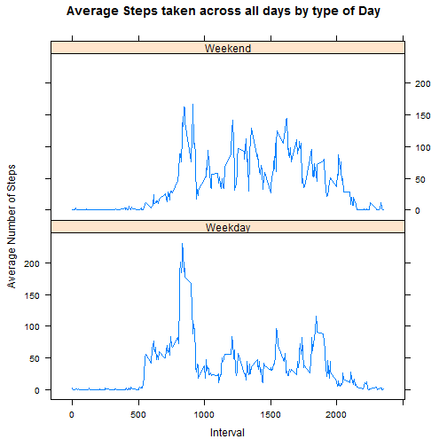

## Loading and preprocessing the data

First we read the data from the zip file and convert the date column in "Date" type


```r
data <- read.csv(unz("activity.zip","activity.csv"))
data$date <- as.Date(strptime(data$date,format="%Y-%m-%d"))
```

## What is mean total number of steps taken per day?

We First count the total number of steps taken per day and make an histogram of it.


```r
totalsteps <- aggregate(data$steps ~ data$date,data=data,sum)
names(totalsteps) <- c("Date","Steps")
hist(totalsteps$Steps,breaks=20,col=75, main="Total steps by day",xlab="Number of steps taken")
```

 

Now we calculate the mean and median of the total number of steps taken per day


```r
options(scipen = 1, digits = 2)
meansteps<-signif(mean(totalsteps$Steps),digits=7)
mediansteps<-median(totalsteps$Steps)
```

The mean total number of steps taken per day is 10766.19.  
The median total number of steps taken per day is 10765.

## What is the average daily activity pattern?

First we calculate the average steps taken in each interval and we make a plot of that.


```r
avsteps<-aggregate(data$steps ~ data$interval, data=data,mean)
names(avsteps)<-c("interval","steps")
plot(avsteps$interval, avsteps$steps, type="l", main="Average steps taken by Interval across all days",xlab="Interval",ylab="Steps",col="red")
```

 

And now we calculate the max interval


```r
max<-which(avsteps$steps == max(avsteps$steps),arr.ind=TRUE)
maxinterval<-avsteps[max,1]
```

The 5.minute interval, on average across all the days in the dataset, that contains the maximum number steps is 835

## Imputing missing values

First we calculate the total number of missing values (NA's)


```r
totalna<-sum(is.na(data$steps))
```

The total number of missing values is 2304

Now we fill the missing values with the mean steps for the corresponding interval across all days, in a new data frame
(I had to fix the format of the Date column)


```r
data2<-data.frame()
for(i in 1:17568)
      {
      if(is.na(data[i,1]))
            {
            data2[i,1]<-data$date[i]
            data2[i,2]<-data$interval[i]
            data2[i,3]<-avsteps[avsteps$interval==data[i,3],2]
            }
      else
            {
            data2[i,1]<-data$date[i]
            data2[i,2]<-data$interval[i]
            data2[i,3]<-data$steps[i]
            }
      
      }
names(data2)<-c("date","interval","steps")
data2$date<-as.Date(data2$date,origin="1970-01-01")
```

Now we make the histogram of the total number of steps taken each day (we first calculate the total steps by day)


```r
totalsteps2 <- aggregate(data2$steps ~ data2$date,data=data2,sum)
names(totalsteps2) <- c("Date","Steps")
hist(totalsteps2$Steps,breaks=20,col=84, main="Total steps by day (with filling NA's)",xlab="Number of steps taken")
```

 

We can see that the hitogram differs from the first one, because the NA were considered as 0's before, and now they take the average steps. Is normal to think that the numbers of steps increase in the median one of the first plot because we took the average of all days.

Now we calculate the mean and median


```r
options(scipen = 1, digits = 2)
meansteps2<-signif(mean(totalsteps2$Steps),digits=7)
mediansteps2<-median(totalsteps2$Steps)
```

The mean total number of steps taken per day, with the missing values replaced, is 10766.19.  
The median total number of steps taken per day, with the missing values replaced, is 10766.19.

The results are almost the same (little difference in the median), because we fill the NA with the average so it just added more values to the same average.

When we imput missing data the totals decrease but the mean and median stay, because we fill them with the average, but if we use another strategy, like the minium value or maybe replace with 0, the histograms and calculates changes a lot.

## Are there differences in activity patterns between weekdays and weekends?

First we create the new column defining if a day is a weekday or weekend
(First I have to change the localtime, because I speak spanish and could generate problems if someone different opens it)


```r
Sys.setlocale("LC_TIME", "C")
```

```
## [1] "C"
```

```r
for(i in 1:17568)
      {
      if(weekdays(data2[i,1]) %in% c("Monday","Tuesday","Wednesday","Thursday","Friday"))
            {
            data2$day[i]<-"0"
            }
      else
            {
            data2$day[i]<-"1"
            }
      
      }
data2$day<-factor(data2$day, levels=c("0","1"),labels=c("Weekday","Weekend"))
```

Now we make the time series plot


```r
library(lattice) 

avsteps2<-aggregate(data2$steps ~ data2$interval+data2$day, data=data,mean)
names(avsteps2)<-c("interval","day","steps")
xyplot(steps~interval|day,data=avsteps2,type="l",main="Average Steps taken across all days by type of Day",xlab="Interval",ylab="Average Number of Steps",layout=c(1,2))
```

 

We can see different patterns that shows that in weekdays the person tooks more steps during first intervals(morning) and in Weekends is in different intervals, probably because he went out at different hours.
